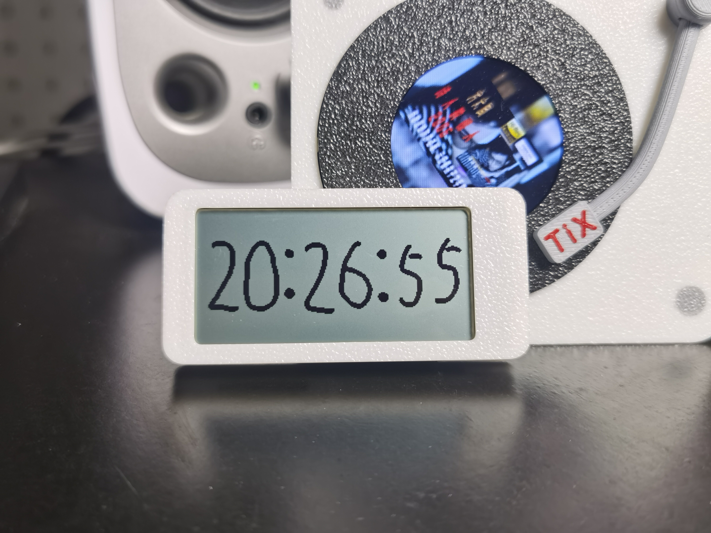
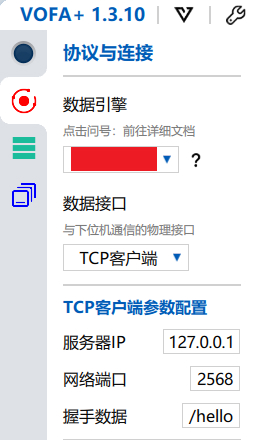

# Tick Dance 时间跳动全反射小钟

## 一、项目简介

演示视频：[【Bilibili】@realTiX - 时间跳动小钟](https://www.bilibili.com/video/BV1UE6sBmEnZ)

这是一个以 8Hz 频率跳动字符的全反射屏小钟。使用局刷刷屏，效率更高。设计用于验证我最近编写的一个支持空闲任务与 tickless 的裸机事件驱动框架：

* Gitee: [TiX233/ltx](https://gitee.com/TiX233/ltx)
* Github: [TiX233/ltx](https://github.com/TiX233/ltx)

## 二、开源管理

本仓库负责管理本项目的单片机代码部分，所有部分开源链接如下：

* 单片机代码：
  * Github：[TiX233/tick_dance](https://github.com/TiX233/tick_dance)
  * Gitee：[TiX233/tick_dance](https://gitee.com/TiX233/tick_dance)
* 原理图/PCB：
  * 立创开源平台：[时间跳动全反射小钟](https://oshwhub.com/realtix/idle_sleep_clock)
* 外壳：
  * MakerWorld：[@realTiX - 时间跳动全反射小钟](https://makerworld.com.cn/zh/@realTiX)

## 三、烧录

使用 `jlink/daplink/...` 等等 swd 调试器进行固件烧录，可使用 keil 编译烧录或其他 swd 固件烧录工具，固件在 pcb 开源页面附件有提供

## 四、调试

如果您需要对本项目进行二次开发或拓展，那么应该需要一些调试手段。

本项目没有引出串口，输入输出信息是通过 `segger RTT` 保存在一块 ram 中的，当调试器链接后，电脑用通过 `openOCD` 来对内存进行写入读出以实现输入输出，理论上，这会比串口更快，毕竟只要读写内存，而无需外设收发，并且还能保存一定的历史输出。  

如果您有 `jlink`，那么可以直接用 `segger` 提供的 `rttviewer` 进行调试，这里仅提供使用 `dap-link` 的调试方法：

1. 在普冉官网下载官方提供的 `openocd` 版本，将其加入环境变量
2. 链接调试器和设备，打开任意 `shell`，输入 `openocd -f rtt2tcp.cfg`
   * 注：如果没有加入环境变量，那么上述命令需要输入 openocd.exe 的完整路径
3. 打开任意支持 `tcp` 的串口调试工具，这里以 `vofa+` 为例，填入如下图的配置信息
   * 
4. 链接成功后，即可查看输入输出信息

通过自定义命令，可控制单片机的运行状态，比如暂停某些 app 等等，也可依赖发布订阅机制实现数据更新后的自动打印，在 `ltx_cmd.c` 中提供的 `/print` 命令有一个 `heart_beat` 样例，用来每秒打印心跳，您可参考该样例来设置自己的订阅数据打印；  
如果您需要经常修改一些参数如尝试某些不同的背景颜色，那么也无需重新烧录，在 `ltx_cmd.c` 中提供了一个 `/param` 命令，该命令可对 `ltx_param.c` 中指向的自定义数据进行读写；

所有的自定义命令可在 `ltx_cmd.c` 中查看，也可开机后给单片机发送 `/help` 命令来列出所有命令，您也可以参考这些命令创建一些方便调试自定义命令，以下是目前所有的自定义命令，部分命令可能会影响系统的正常运行：

| 命令 | 作用 |
|-|-|
| `echo` | 返回第二个参数来测试收发功能 |
| `hello` | 打印 hello world |
| `help` | 帮助，无参数则列出所有命令，第二个参数可设置为某个命令（如 `/help print`） |
| `print` | 在某些数据更新后进行打印，非阻塞，非 poll，依赖 ltx 发布订阅机制 |
| `param` | 读写自定义参数 |
| `alarm` | 测试 ltx 闹钟功能用，非阻塞，第二个参数可设置闹钟倒计时 tick，会在闹钟到时后打印 |
| `reboot` | 重启 |
| `ltx_app` | 管理 ltx app 用，可列出所有 app 及其 task，可对其进行暂停继续或销毁操作 |
| `fill_unit` | 将某个 unit 填为单色块，阻塞 |
| `draw_unit` | 将某个 unit 填为传入的三个字节，阻塞 |
| `rtc_get` | 获取 rtc 时间 |
| `rtc_set` | 设置 rtc 时间 |
| `frame_low_rate` | 设置低功耗模式下屏幕刷新率 |

## 五、其他

目前发现开启 tickless 的话，会有小概率出现闹钟提前响应的 bug，也就是比如设置一个 20tick 后触发的闹钟，实际上它有小概率会在 0tick 后立即被触发，导致系统出现异常，暂时没有查明原因，所以建议只开启空闲休眠而暂不要进一步开启 tickless。希望有大佬能找出原因
